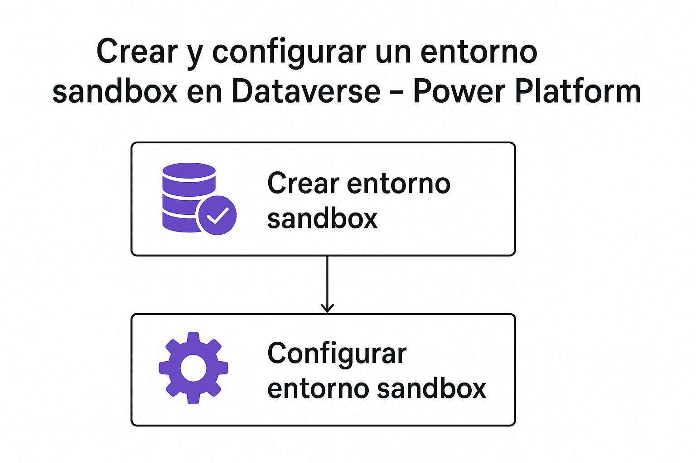
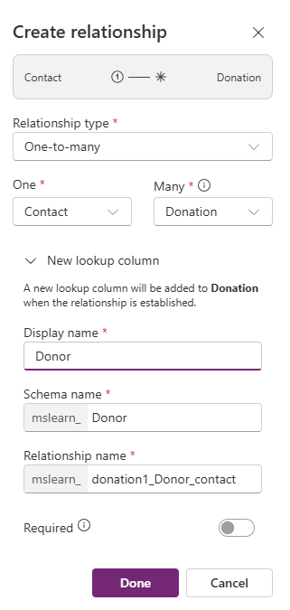
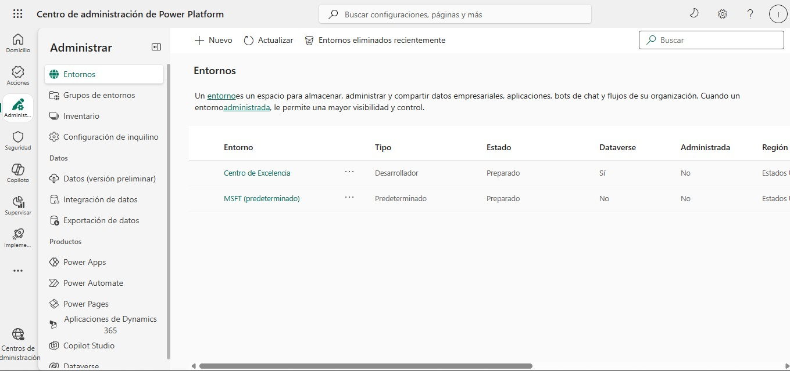

# Crear y configurar un entorno sandbox

## Objetivo de la práctica:
Al finalizar la práctica, serás capaz de:
- Demostrar la capacidad de crear y personalizar un entorno sandbox de Power Platform y establecer sus configuraciones iniciales (tipo, región, base de datos) para usarlo como espacio seguro de desarrollo y prueba.

### Objetivo Visual 

### Duración aproximada:
- 60 minutos.

### Tabla de ayuda:
Acceso a tu cuenta Microsoft 365.

## Instrucciones 
### Tarea 1. Crear y configurar un entorno sandbox.
Paso 1. Abre tu navegador y ve al Centro de administración de Power Platform (PPAC): admin.powerplatform.microsoft.com. Inicia sesión con tu cuenta de administrador que tenga los permisos necesarios (admin del servicio, admin global, o admin de Power Platform).

Paso 2. Inicia la creación del entorno. 
- En el panel de navegación izquierdo, selecciona ´Entornos´.
- En la barra de comandos superior, haz clic en el botón ´+ Nuevo´.

Paso 3. Configuración básica del entorno. En la primera ventana de configuración:
- Nombre: asigna un nombre único y descriptivo, como "mi entorno sandbox de prueba".
- Tipo: selecciona sandbox. Este paso es crucial para el aislamiento del trabajo de prueba.
- Región: elige la región geográfica más cercana a tus usuarios para el mejor rendimiento.

Paso 4. Configuración de la base de datos. Haz clic en ´Siguiente´ o navega a la sección de configuración de la base de datos:
- Base de datos: asegúrate de que la opción para crear una base de datos para este entorno esté activada ´(Sí)´.
- Idioma: selecciona el idioma base para la interfaz de Dataverse (ej. Español).
- Moneda: define la moneda predeterminada de la región (ej. EUR, USD).
- Aplicaciones Dynamics 365: deja esta opción desactivada si solo usarás Dataverse y Power Apps (para ahorrar consumo de almacenamiento).

Paso 5. Finaliza la creación. Revisa todas las configuraciones y haz clic en el botón ´Guardar´.

### Tarea 2. Configurar seguridad mínima.
Paso 1. En el Centro de administración de Power Platform (PPAC), haz clic en el nombre de tu nuevo entorno.

Paso 2. En la barra de comandos superior del entorno, haz clic en ´Configuración´. Se abrirá una nueva página. En el menú de navegación, selecciona ´Usuarios + permisos´ y luego haz clic en ´Usuarios´.

Paso 3. Busca tu usuario (o un usuario de prueba). Haz clic en el usuario y luego en el botón ´...´ (más acciones). Selecciona ´Administrar roles de seguridad´.

Paso 4. Asigna el rol ´Administrador del Sistema´ a tu usuario.

### Tarea 3. Probar la configuración creando tablas mediante Copilot.
Paso 1. En https://make.powerapps.com/ selecciona ´Tablas´ en el panel de navegación izquierdo.

Paso 2. Selecciona ´Empezar con Copilot´.

Paso 3. En la pantalla ´Describir las tablas que creará Copilot´, introduce: "Crea una tabla para administrar las donaciones recibidas. La tabla debe identificar el tipo de donación que se recibió, el importe, la fecha y el motivo, si se proporcionó".

Paso 4. Junto al botón ´Generar´, selecciona ´Configuración de tabla´ y configura lo siguiente:
- Opciones de tabla: una tabla.
- Tamaño de la tabla: pequeña.
- **No** incluyas relaciones.

Paso 5. Selecciona el botón ´Generar´. Copilot solo debería crear una tabla llamada ´Donation´. Si se crearon más, puedes eliminarlas diciéndole a Copilot el nombre de la tabla que deseas eliminar.

Paso 6. En la barra de comandos de la parte superior, selecciona ´+ Tabla existente´.

Paso 7. En la pantalla ´Seleccionar tabla´, cambia de ´Recomendadas´ a ´Todas las tablas´.

Paso 8. En el campo de búsqueda, introduce ´Contact´ y elige ´Agregar seleccionado´.

Paso 9. En la barra de comandos, selecciona ´Crear relaciones´.

Paso 10. Configura la relación de la siguiente forma:
- Tipo de relación: uno a varios.
- Uno: Contact.
- Varios: Donation.
- Nombre para mostrar: Donor.

Paso 11. Selecciona ´Listo´ y, de esta manera, creaste un modelo que prueba que el entorno está completamente funcional.

### Resultado esperado:

