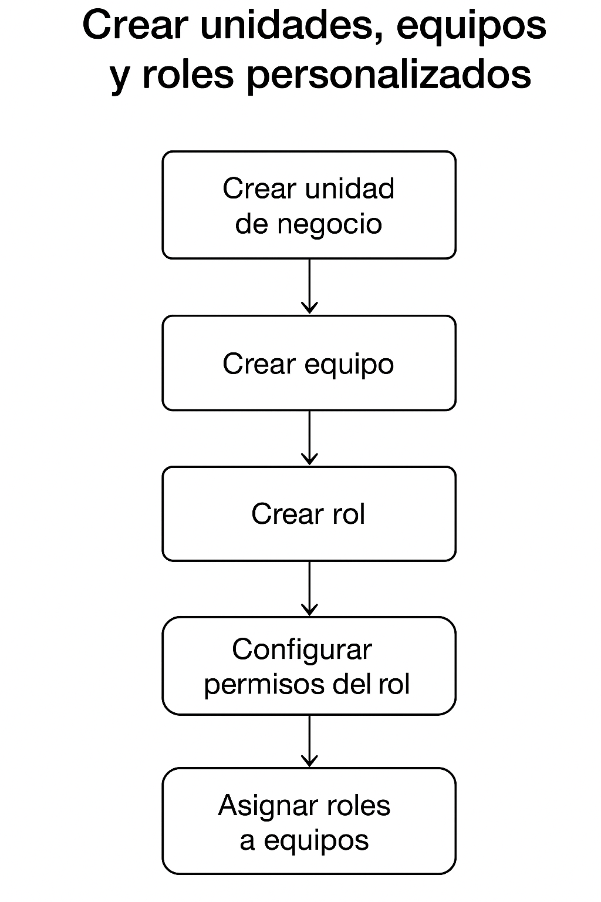
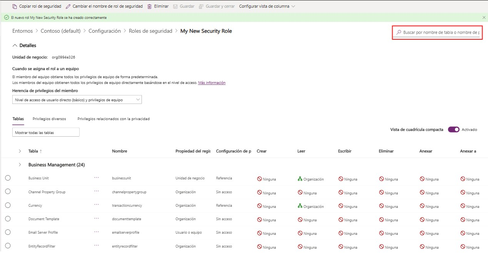
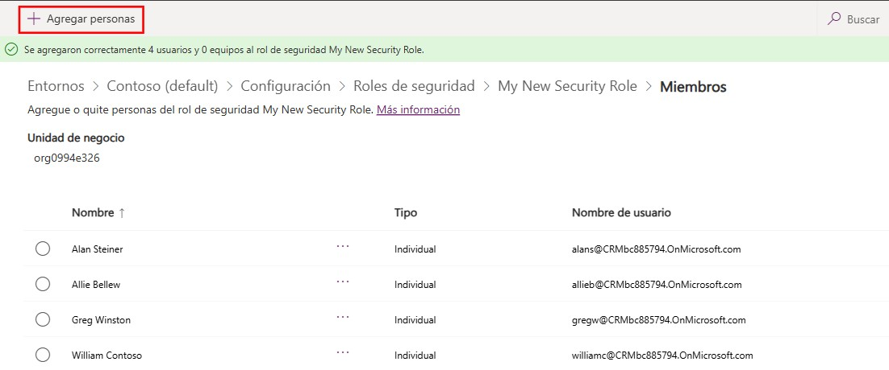

# Crear unidades, equipos y roles personalizados

## Objetivo de la práctica:
Al finalizar la práctica, serás capaz de:
- Aplicar la arquitectura de seguridad de Dataverse al crear y configurar unidades de negocio, equipos y roles de seguridad personalizados, estableciendo así un modelo de permisos que defina la visibilidad y el acceso de los usuarios a los datos y que refleje la estructura organizacional de la empresa.

### Objetivo visual 

### Duración aproximada:
- 60 minutos.

### Tabla de ayuda:
Acceso a tu cuenta Microsoft 365.

## Instrucciones 
### Tarea 1. Crear una unidad de negocio (business unit) en Dataverse.
Las **unidades de negocio** definen la estructura organizacional dentro de Dataverse y controlan cómo se segmenta la seguridad y el acceso a los datos.

**Paso 1.** Ingresa a https://admin.powerplatform.microsoft.com y haz clic en el nombre de tu entorno.

**Paso 2.** Entra a la configuración del entorno, en la parte superior del panel del entorno, haz clic en `Settings` (configuración), se abrirá un menú con categorías.

**Paso 3.** Entra a `Usuarios y Permisos` dentro de `Settings`, ve a `Users + permissions` →` Business units` (unidades de negocio).

**Paso 4.** Crea una nueva unidad de negocio, en la parte superior derecha, pulsa `+ New business unit`, se abrirá un formulario.

**Paso 5.** Completa el formulario, verás varios campos. Los importantes son:
- **Name** (nombre).
  - Nombre de la unidad. Ejemplos: "Ventas", "Marketing", "Región Norte", etc. <ins>Debe ser único</ins> dentro de la organización.
- **Parent Business Unit** (unidad de negocio padre), aquí decides dónde va dentro de la jerarquía. Opciones típicas:
  - Si es la segunda unidad que creas, el padre será <ins>Root Business Unit</ins> (la unidad raíz que Dataverse crea automáticamente).
  - Si ya tienes varias unidades, selecciona la unidad superior correspondiente.
  - La **jerarquía** controla la **herencia de permisos y visibilidad** de datos, así que escógelo bien.
- **Description** (descripción), opcional, pero útil para documentar. Ejemplo: "Unidad responsable de gestionar ventas para Latam".

**Paso 6.** Haz clic en `Save & Close` para que la unidad de negocio quede creada.

### Tarea 2. Crear equipos dentro de una unidad de negocio en Dataverse.
**Paso 1.** En el **Centro de administración de Power Platform**, haz clic en el nombre de tu entorno.

**Paso 2.** Abre configuraciones, dentro del entorno, haz clic en `Settings`.

**Paso 3.** Abre la sección de administración de equipos, dentro de `Settings Users + permissions` → `Teams`. Aquí verás todos los equipos existentes en el entorno.

**Paso 4.** Crea un nuevo equipo en la parte superior derecha: `+ New team`. Se abrirá un formulario con varias opciones.

**Paso 5.** Completa los campos del equipo:
- **Name** (nombre). Elige un nombre claro. Ejemplos: "Equipo Ventas", "Soporte Nivel 1", "Marketing Digital".
- **Business Unit** (unidad de negocio). Selecciona la unidad de negocio donde quieres que resida el equipo. Ejemplo: "Ventas Latam".
- **Team type** (tipo de equipo). Tipos más usados:
  - **Owner Team**:	tiene propiedad de registros y seguridad fuerte. El más común y el recomendado para comenzar.
  - **Azure AD Security Group Team**:	usa un grupo de Azure AD como miembros.
  - **AAD Office Group (Microsoft 365 Group)**:	equipo conectado a un grupo de Microsoft 365.
  - **Access Team**:	no posee registros, sirve para compartir acceso temporal.
- **Administrator** (administrador del equipo). Selecciona un usuario responsable del equipo (debe pertenecer a la misma unidad de negocio.)
- **Description** (descripción). Opcional. Puedes documentar propósito, funciones, etc.

**Paso 6.** Guarda el equipo, haz clic en `Save & Close`.

**Paso 7.** Agrega miembros al equipo. Una vez guardado, ábrelo de nuevo, ve a la pestaña `Member` y haz clic en: `+ Add members`. Selecciona los usuarios que pertenezcan a esa unidad de negocio.

**Paso 8.** Asigna roles de seguridad al equipo para que tenga permisos:
  1. Dentro del equipo, ve a la pestaña `Security roles`.
  2. Da clic en `Manage roles`.
  3. Selecciona los roles apropiados para su función. Esto define qué datos y acciones puede realizar el equipo. 

### Tarea 3. Crear un rol personalizado.
**Paso 1.** En el **Centro de administración de Power Platform**, haz clic en el nombre de tu entorno.

**Paso 2.** En el panel `Acceso` ubicado a la derecha, ubícate en `Roles de seguridad` y selecciona `Ver todo`.

**Paso 3.** Selecciona `Nuevo rol` en la barra del menú superior, esto abrirá el **diseñador de roles de seguridad**.

**Paso 4.** En el campo `Nombre del rol`, introduce un nombre, como: "mi nuevo rol de seguridad", para tu rol de seguridad.

**Paso 5.** Selecciona una unidad de negocio (es posible que solo tengas una de forma predeterminada; esta es una entrada obligatoria).

**Paso 6.** Selecciona `Guardar`. Tras unos momentos, el nuevo rol de seguridad aparecerá en una pantalla de configuración, con una lista de las tablas en el entorno. Puedes buscar la tabla en el **campo de búsqueda**, en la parte superior derecha de la pantalla de configuración.

**Paso 7.** Cuando encuentres la tabla en la lista, selecciónala.
  - Aparecerán menús desplegables bajo los distintos privilegios que puedes asignar para este rol de seguridad, como "Crear", "Leer", "Escribir", "Eliminar", "Anexar", "Anexar a", "Asignar" y "Compartir".
  - Selecciona el nombre de la tabla para escoger el ámbito para realizar esa acción. El ámbito determina la profundidad o altura en la jerarquía del entorno en la que el usuario puede realizar una acción en particular.
  - Utiliza los <int>menús desplegables</int> a fin de asignar privilegios para ese grupo de seguridad y para esa tabla en particular.
  - Para el nuevo rol, deja que "Organización" pueda crear, leer, escribir, eliminar, asignar y compartir un registro en esta tabla.

**Paso 8.** Selecciona `Guardar y cerrar` en la barra de comandos.

### Tarea 4. Asignar usuarios a su rol de seguridad.

Tras guardar y cerrar el nuevo rol de seguridad, estarás en la pantalla **Roles de seguridad**. Si no sabes dónde está, ve a `Configuración` > `Usuarios + permisos` > `Roles de seguridad`.

**Paso 1.** Busca el rol de seguridad que creaste. Desplázate hacia abajo en la lista, o introduce el nombre del nuevo rol en el campo `Buscar por nombre` de la parte superior derecha de la pantalla.

**Paso 2.** Selecciona el rol y luego el botón `Más acciones (...)` > `Miembros`. Si seleccionas por error el nombre del rol, regresarás a la pantalla de configuración de este; si regresa a la pantalla `Roles de seguridad`, selecciona el botón `Más acciones`.

**Paso 3.** El nuevo rol de seguridad tendrá un botón `Agregar personas`. Selecciónalo.

**Paso 4.** Aparecerá un panel `Agregar personas` en el lado derecho de la pantalla. Tiene un campo de búsqueda donde puedes introducir el nombre de una persona, el correo electrónico o el nombre de un equipo. Busca y agrega varios usuarios seleccionando su nombre en los resultados de búsqueda.

**Paso 5.** Cuando tengas a varias personas en la lista, selecciona el botón `Agregar` en la parte inferior del panel `Agregar personas`.

**Paso 6.** Tras unos momentos, los usuarios para el nuevo rol de seguridad aparecerán debajo de `Miembros`.
  - Si necesitas eliminar a un usuario, puedes seleccionar el nombre de la persona, al hacerlo, aparecerá un botón de acción `Eliminar` en la parte superior izquierda de la barra de comandos.
  - Si necesitas agregar a otro usuario, comprueba que no haya ningún usuario seleccionado, verás el botón `Agregar personas` en la parte superior izquierda de la barra de comandos.

### Resultado esperado

