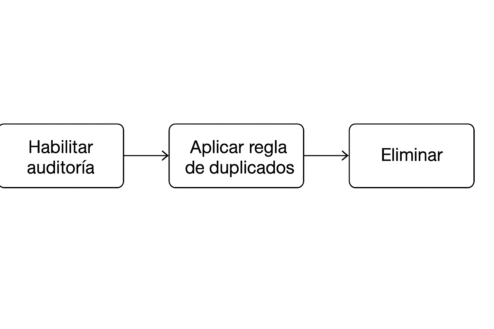
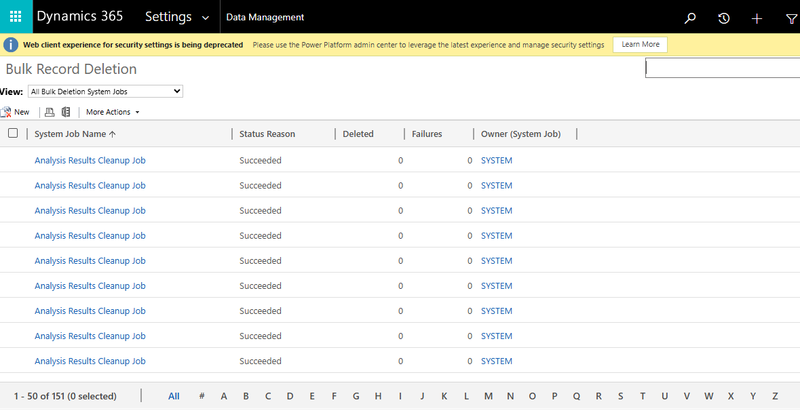

# Práctica 3. Habilitar auditoría, aplicar reglas de duplicados y eliminación

## Objetivo de la práctica:
Al finalizar la práctica, serás capaz de:
- Establecer la gobernanza y la integridad de los datos mediante la activación de la auditoría para el seguimiento de cambios, la configuración de reglas de detección de duplicados para mantener la calidad de los datos y la planificación de trabajos de eliminación masiva para optimizar el almacenamiento y asegurar el cumplimiento normativo.

### Objetivo visual 

### Duración aproximada:
- 90 minutos.

### Tabla de ayuda:
Acceso a tu cuenta Microsoft 365.

## Instrucciones 
### Tarea 1. Configurar auditoría para un entorno.
La auditoría puede configurarse en tres niveles: un **entorno**, **tabla** y **columna**. La auditoría debe activarse primero en el nivel de **entorno**. Para registrar los cambios de datos en una tabla, la auditoría debe estar activada para la tabla y para la columna.

**Paso 1.** Inicia sesión en [https://admin.powerplatform.microsoft.com](https://admin.powerplatform.microsoft.com).

Paso 2. En el menú izquierdo, seleccione Seguridad > Cumplimiento.

Paso 3. Seleccione el mosaico Auditoría.

Paso 4. Seleccione el entorno para el que desea configurar la auditoría.

Paso 4. Seleccione Configurar auditoría. En el cuadro de diálogo Auditoría, seleccione Activar auditoría.

Paso 5. Revise la lista de entidades de datos de Dataverse y aplicaciones de Dynamics 365.

Paso 6. Revise y actualice la retención de registro de eventos seleccionando el menú desplegable.

Paso 7 .Seleccione el período que cumpla su política de retención de datos. Cuando el período de retención de auditoría se establece en Siempre, los registros no se eliminan. Cuando el período de retención de auditoría se establece en cualquier otro valor, los registros se eliminan continuamente a partir del momento en que un registro de auditoría exceda el tiempo definido en la directiva de retención.

### Tarea 2. Iniciar/detener la auditoría de un entorno y establecer la directiva de retención

Paso 1. Inicie sesión en [https://admin.powerplatform.microsoft.com](https://admin.powerplatform.microsoft.com).

Paso 2. En el panel de navegación, seleccione Administrar.

Paso 3. En el panel Administrar, seleccione Entornos. A continuación, elija un entorno.

Paso 4. Seleccione Configuración>Auditoria y registros>Configuración de auditoría.

Paso 5. Puede establecer un período de retención que especifique el tiempo que se mantendrán los registros de auditoría en un entorno. En Conservar estos registros durante, elija el período de tiempo que desea conservar los registros.

Paso 6. Seleccione Guardar.

### Tarea 3. Configurar la auditoría para una o varias tablas y columnas en Power Apps
Paso 1. Inicie sesión en Power Apps con sus credenciales de Administrador o Personalizador del sistema.

Paso 2. Seleccione el entorno para el que desea configurar la auditoría.

Paso 3. Seleccione Tablas.

Paso 4. Seleccione una tabla.

Paso 5. En la barra de comandos, seleccione Editar.

Paso 6. En la barra de comandos, seleccione Editar propiedades de tabla.

Paso 7. Expanda Opciones avanzadas.

Paso 8. Seleccione la casilla Cambios de auditoría en sus datos.

Paso 9. Seleccione Guardar.

Paso 10. En la barra de comandos, seleccione <- Atrás.

Paso 11. En Esquema, seleccione Columnas.

Paso 12. Seleccione una columna que desee habilitar para auditoría y luego expanda Opciones avanzadas.

Paso 13. Seleccione la casilla Habilitar auditoría.

Paso 14. Seleccione Guardar.

Paso 15. Repita los pasos 3 a 10 para todas las tablas y columnas que desee editar.

### Tarea 4. Crear y activar una Regla de Duplicados
Paso 1. Ingrese en: https://make.powerapps.com y en la parte superior derecha, seleccionar el entorno donde trabajará.

Paso 2. Abra el área de reglas de duplicados: 
- Seleccione el ícono de Settings (⚙️) en la esquina superior derecha.
- Seleccione Advanced settings. (Esto abre la interfaz clásica de Dynamics CRM.)
- Navegue a Settings → Data Management → Duplicate Detection Rules

Paso 3. Cree una nueva regla seleccionando + New y completando los campos recomendados:
- Name: Regla contactos - nombres duplicados
- Description: Detectar contactos con el mismo nombre y correo.
- Base table: Contact
- Matching Criteria:
  - First Name — Exact match
  - Last Name — Exact match
  - Email — Exact match

Paso 4. Guarde la regla seleccionando Save.

Paso 5. Publique y active la regla seleccionando Publish → Activate.

Paso 6. Pruebe la regla:
- Abra la tabla seleccionada (por ejemplo, Contact).
- Cree un registro con datos de prueba.
- Intente crear otro registro con los mismos datos.
Debe aparecer la advertencia de duplicado.

### Tarea 5. Configurar trabajos de eliminación (Bulk Delete)
Paso 1. Abra la sección de eliminación masiva
- Ir a: Settings → Advanced settings
- Navegar a: Settings → Data Management → Bulk Record Deletion

Paso 2. Cree un nuevo trabajo de eliminación
- Seleccionar: + New Bulk Delete job

Paso 3. Defina criterios por ejemplo "Eliminar contactos sin actividad creados hace más de 30 días"
- Establecer la tabla: Contact
- Configurar el filtro:
  - Filtrar por: Created On → Older than 30 days
  - Agregar condición: Activities → No related activities

Paso 4. Configure la programación
- Seleccionar: Run this job → Once
- Definir: Start time → Now
- Habilitar o no: Email notifications (opcional)

Paso 5. Confirme seleccionando Next → Submit

Paso 6. Vea el progreso
- Revisar el estado del job (Waiting / In progress / Succeeded).
- Actualizar la vista hasta observar la finalización.
  
### Resultado esperado

