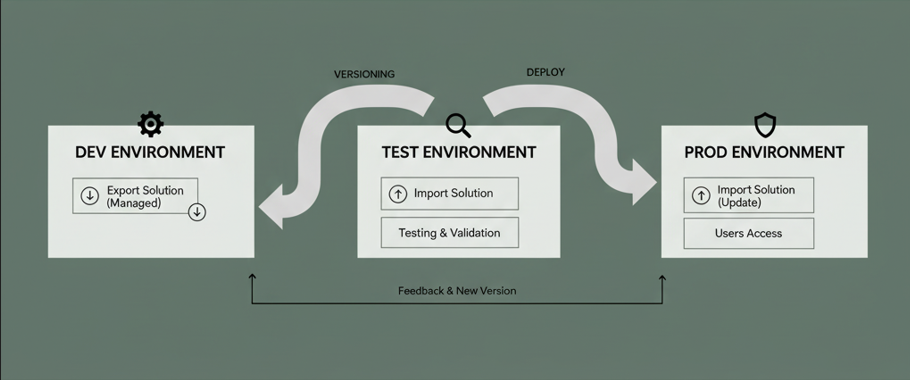

# Exportar, importar y versionar soluciones

## Objetivo de la práctica:
Al finalizar la práctica, serás capaz de:
- Ejecutar el ciclo de vida de la aplicación (ALM) demostrando la capacidad de exportar una solución existente desde el entorno de desarrollo como Administrada, para luego importarla y actualizarla en un entorno de destino, verificando la transferencia exitosa de componentes y el mantenimiento del control de versiones.

## Objetivo Visual 

## Duración aproximada:
- 60 minutos.

## Tabla de ayuda:
Acceso a tu cuenta Microsoft 365.

## Instrucciones 
### Tarea 1. Exportar de Power Apps
Paso 1. Inicie sesión en Power Apps y seleccione Soluciones en el panel de navegación de la izquierda. Si el elemento no se encuentra en el panel lateral, seleccione …Más y, a continuación, el elemento que desee.

Paso 2. En la lista de soluciones, seleccione la solución no administrada que desea exportar y luego seleccione Exportar. Tenga en cuenta que no puede exportar soluciones administradas.

Paso 3. Aparece el panel derecho Antes de exportar. Elija entre las siguientes opciones y, a continuación, seleccione Siguiente:
- Publique todos los cambios. Tenga en cuenta que, al exportar una solución no administrada, solo se exportan los componentes publicados. Le recomendamos que seleccione Publicar todos los cambios para asegurarse de que todos los componentes estén incluidos en la solución exportada.

Paso 4. Aparece el panel derecho Exportar esta solución. Introduzca o seleccione entre las siguientes opciones y, a continuación, seleccione Exportar:
- Número de versión: Power Apps incrementa automáticamente la versión de su solución mientras se muestra la versión actual. Puede aceptar la versión predeterminada o introducir la suya.
- Exportar como: seleccione el tipo de paquete, Administrado o No administrado. Más información: Soluciones administradas y no administradas
- Ejecutar comprobador de soluciones al exportar. Ejecute el comprobador de la solución en la solución para detectar problemas de rendimiento y estabilidad.
  

La exportación puede tardar varios minutos en completarse. Una vez finalizada, el archivo .zip de exportación está disponible en la carpeta de descarga especificada por el explorador web.

### Tarea 2. Importar soluciones
Paso 1. Inicie sesión en Power Apps y seleccione Soluciones en el panel de navegación de la izquierda. Si el elemento no se encuentra en el panel lateral, seleccione …Más y, a continuación, el elemento que desee.

Paso 2. En la barra de comandos, seleccione Importar solución.

Paso 3. En la página Importar una solución , seleccione desde dónde desea importar la solución:
- Este dispositivo. Seleccione Examinar para buscar el archivo comprimido (.zip o .cab) ubicado en el dispositivo que contiene la solución que desea importar.
- Canalización. Seleccione esta opción para importar una solución desde una canalización. Para usar esta opción, debe haber configurado la solución dentro de una canalización. 

Paso 4. Seleccione Siguiente.

Paso 5. Información sobre cómo se muestra la solución. De forma predeterminada, en la sección Configuración avanzada, si los pasos del complemento (también conocidos como pasos de procesamiento de mensajes SDK) y los flujos existen en la solución, se importarán. Desmarque la opción Habilitar pasos y flujos del complemento incluidos en la solución si no desea que la importación intente activar cualquier paso del complemento que se importe en un estado inactivo. Los flujos no se desactivarán cuando la opción esté desactivada.

Paso 6. Si la solución contiene referencias de conexión, se le pedirá que seleccione las conexiones que desee. Si aún no existe una conexión, cree una nueva. Seleccione Siguiente.

Paso 7. Si su solución contiene variables de entorno, se le pide que especifique valores. No verá esta pantalla si los valores ya están presentes en su solución o en el entorno de destino.

Paso 8. Si se detectan dependencias faltantes en el entorno de destino, se presenta una lista de las dependencias. En entornos donde la versión del paquete requerida está disponible para su importación en el entorno de destino, se presenta un enlace para resolver la dependencia. Seleccionar el vínculo le lleva al Centro de administración de Power Platform donde puede instalar la actualización de la aplicación. Una vez completada la actualización de la aplicación, puede volver a iniciar la importación de la solución.

Paso 9. Seleccione Importar. La solución importa en segundo plano y puede tardar unos instantes.

### Tarea 3. Analizar el siguiente escenario y responder en consecuencia
El desarrollador principal, por error, exportó la aplicación de nóminas como una Solución NO Administrada y la importó en el entorno de Producción. Tres meses después, el equipo de TI intenta desinstalar una característica obsoleta, pero el proceso falla y deja componentes huérfanos.

Selecciona la respuesta más adecuada para cada pregunta.

1. ¿Cuál fue la principal consecuencia de importar una Solución NO Administrada en el entorno de Producción?

A. Se eliminaron todos los datos existentes en el entorno de Producción.

B. Los componentes de la solución quedaron disponibles para ser modificados o eliminados directamente en el entorno de Producción.

C. La aplicación dejó de funcionar inmediatamente porque los flujos de trabajo se rompieron.

D. La solución se revirtió automáticamente a la versión anterior instalada en el entorno.

2. En el escenario donde se intentó desinstalar la característica obsoleta, ¿por qué el proceso falló y dejó componentes huérfanos?

A. Solo se pueden desinstalar soluciones si el entorno está en modo de administración.

B. Solo se eliminan las referencias a los componentes, dejando los componentes base como parte de la capa base (huérfanos).

C. La solución no tenía permisos de "Eliminar" en el Rol de Seguridad.

D. El número de versión de la solución era demasiado alto para el entorno de Producción.

3. Si la solución se hubiera importado correctamente como Solución Administrada, ¿qué habría permitido que la desinstalación fuera exitosa y limpia?

A. Permite que todos los componentes sean editados manualmente por el equipo de TI antes de desinstalar.

B. Contiene un 'candado' que fuerza a que el entorno elimine todos los componentes de la solución al mismo tiempo que la capa.

C. Crea automáticamente copias de seguridad de todos los componentes en Azure DevOps.

D. Requiere que se reinicie la instancia de Dataverse antes de la desinstalación.

4. ¿Cuál es el principal beneficio de seguridad que una Solución Administrada ofrece al entorno de Producción?

A. Asegura que los datos no puedan ser eliminados por usuarios con el Rol de Creador de Entornos.

B. Impide que los usuarios (incluso los administradores) modifiquen directamente las propiedades de los componentes de la solución.

C. Permite auditar automáticamente todos los cambios realizados a la solución sin configuración adicional.

D. Bloquea el acceso a la aplicación para usuarios que no tienen licencia Premium.

5. ¿En qué tipo de entorno y con qué tipo de solución se deben realizar siempre los cambios y las correcciones de errores antes de la migración?

A. En el entorno de Pruebas (TEST) usando una Solución Administrada.

B. En el entorno de Producción (PROD) usando una Solución No Administrada.

C. En el entorno de Desarrollo (DEV) usando una Solución No Administrada.

D. En el Centro de Administración de Power Platform (PPAC) usando el rol de Administrador Global.

6. En el contexto de ALM, ¿a qué se refiere la frase "componentes huérfanos" que dejó la desinstalación fallida en Producción?

A. Archivos temporales del sistema que deben eliminarse con la herramienta de limpieza de disco.

B. Componentes personalizados (tablas, campos, flujos) que permanecen en el entorno sin estar vinculados a ninguna solución que los 
rastree o gestione.

C. Cualquier componente que no haya sido tocado por el desarrollador durante los últimos 90 días.

D. Los datos de usuario que han quedado sin dueño en una tabla.

7. Si el equipo de TI detecta que la aplicación necesita un cambio menor (un parche) después del despliegue exitoso de la v1.0, ¿cuál es la mejor práctica de ALM para aplicar la corrección?

A. Editar el componente directamente en Producción y luego volver a exportarlo como Administrada.

B. Crear una nueva versión de parche (ej. v1.0.0.1) en DEV y exportarla como Administrada para actualizar PROD.

C. Desinstalar la v1.0 completamente e importar una Solución No Administrada con las correcciones.

D. Usar la función de 'Hotfix' del Centro de Administración para aplicar el cambio sin versionar.

8. ¿Qué sucede si el desarrollador intenta importar una nueva versión de la Solución Administrada que tiene una versión menor a la que ya está instalada en Producción?

A. La importación sobrescribe automáticamente la versión actual con la versión más antigua.

B. La importación es rechazada por el sistema con un error de versión para proteger la estabilidad de la versión instalada.

C. El sistema permite la importación y fusiona las características de ambas versiones.

D. El entorno se desactiva hasta que el administrador apruebe la versión más baja.

9. ¿Cuál es la herramienta o práctica de ALM que se recomienda para eliminar el riesgo de que una persona cometa el error de exportar el tipo de solución incorrecto (No Administrada) a Producción?

A. La función de Auditoría del entorno.

B. Un Rol de Seguridad personalizado que prohíba la exportación.

C. La implementación de Pipelines de Power Platform o Azure DevOps.

D. El uso de la Herramienta de Comprobación de Soluciones.

10. En el contexto de una 'actualización' (importar una nueva versión de una Solución Administrada), si el componente actualizado tiene una versión mayor (ej. de v1.0 a v2.0), ¿qué es cierto sobre el componente antiguo?

A. La versión antigua se mantiene como una capa superpuesta inactiva.

B. Los componentes de la versión antigua que no existen en la nueva versión se eliminan del entorno de destino.

C. El administrador debe desinstalar manualmente la versión v1.0 antes de importar la v2.0.

D. Los metadatos de la versión v1.0 se copian en el entorno de Desarrollo para su custodia.
  
### Resultado esperado

